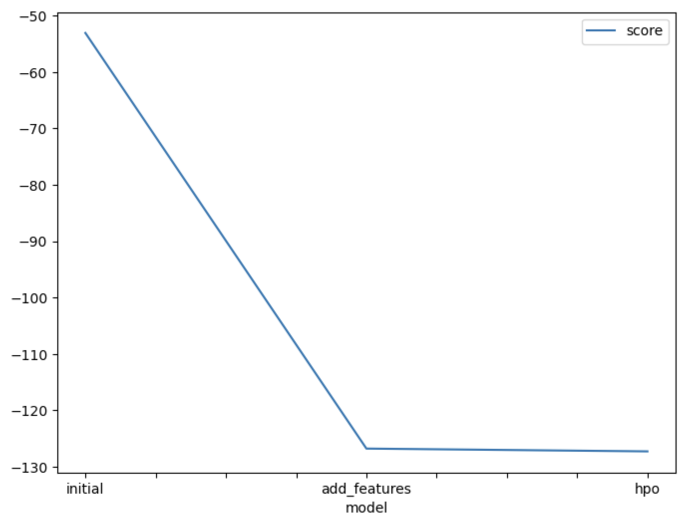
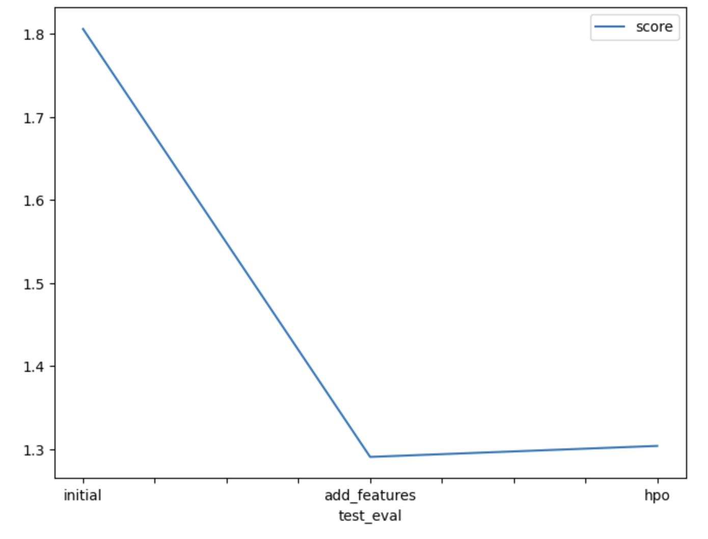

# Report: Predict Bike Sharing Demand with AutoGluon Solution
#### NAME HERE

## Initial Training
### What did you realize when you tried to submit your predictions? What changes were needed to the output of the predictor to submit your results?
The submission of predictions to kaggle required the prediction for bike sharing only to be a positive value. To ensure the predictions for the bike sharing problem are valid for submission, I had to update all negative predictions to 0.

### What was the top ranked model that performed?
The top ranked model was WeightedEnsemble_L3  with a score value of -53.088295.

## Exploratory data analysis and feature creation
### What did the exploratory analysis find and how did you add additional features?
I added additional features by segregating the datetime into year, month and day and having seperate column for that, and then dropped the datetime column.

### How much better did your model preform after adding additional features and why do you think that is?
The kaggle Score after adding the new features was: 1.29082

## Hyper parameter tuning
### How much better did your model preform after trying different hyper parameters?
The kaggle score after adding the hyperparameters was: 1.30407

### If you were given more time with this dataset, where do you think you would spend more time?
By increasing the training time.

### Create a table with the models you ran, the hyperparameters modified, and the kaggle score.
|model|WeightedEnsemble_L3|ExtraTreesMSE_BAG_L2|WeightedEnsemble_L2|score|
|--|--|--|--|--|
|initial|default|default|default|1.80590|
|add_features|default|default|default|1.29082|
|hpo|-127.27579|-127.812174|-128.324154|1.30407|

### Create a line plot showing the top model score for the three (or more) training runs during the project.

TODO: Replace the image below with your own.

### Create a line plot showing the top kaggle score for the three (or more) prediction submissions during the project.

TODO: Replace the image below with your own.

## Summary
TODO: Add your explanation
